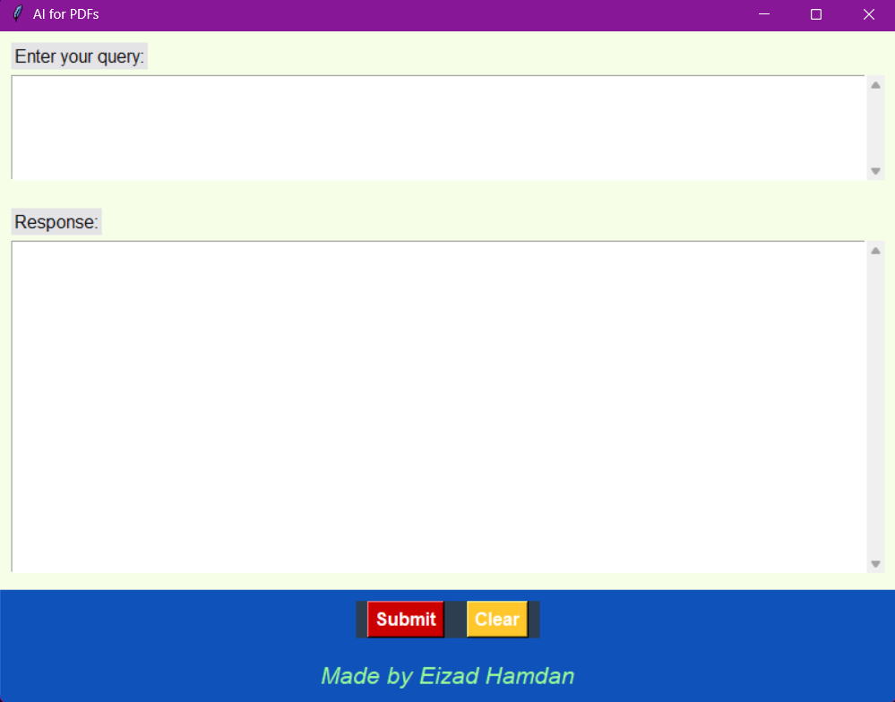

### File: `embedding_function.py`

This module is responsible for configuring and returning the embedding function used in the application. Embeddings enable the system to convert text into vector representations for similarity search, which is a core part of the RAG technique.

#### Key Features

- **Environment Configuration:** Utilizes the `dotenv` library to securely load API keys from a `.env` file.
- **Support for Multiple Embedding Models:** Includes commented-out configurations for:
  - **BedrockEmbeddings** (AWS)
  - **OllamaEmbeddings** (Nomic)
  - **OpenAIEmbeddings** (default).
- **Default Embedding Model:** Uses OpenAI's `text-embedding-ada-002` model for high-quality text vectorization.

#### How it Works

The `get_embedding_function()` initializes and returns the embedding model. The default implementation uses OpenAI embeddings, and the API key is loaded from the environment variables via `os.getenv`.

#### Dependencies

- `langchain_community` for Ollama embeddings.
- `langchain_aws` for Bedrock embeddings.
- `langchain_openai` for OpenAI embeddings.
- `dotenv` for managing environment variables.

#### Customization

To use a different embedding provider, uncomment and configure the relevant code block in the file. Ensure that necessary credentials and dependencies are in place.


### File: `create_database.py`

This script handles the creation and management of the document database for the AI application. It processes PDF files, splits them into chunks, and stores them in a Chroma database for efficient retrieval during queries.

#### Key Features

1. **PDF Loader:** Utilizes `PyPDFDirectoryLoader` to load all PDF files from the `data` directory.
2. **Text Splitting:** Uses `RecursiveCharacterTextSplitter` to break down documents into manageable chunks, ensuring overlap for better context.
3. **Database Management:**
   - Creates or updates the Chroma database.
   - Supports resetting the database using the `--reset` argument.
4. **Chunk Metadata:** Assigns unique IDs to each chunk based on its source, page number, and chunk index.

#### Script Arguments

- `--reset`: Clears the existing database before creating a new one.

#### Dependencies

- `langchain_community` for PDF loading.
- `langchain_text_splitters` for splitting document text.
- `langchain.schema.document` for document handling.
- `langchain_chroma` for Chroma database management.
- `embedding_function` for embedding configuration.
- Standard Python libraries: `argparse`, `os`, `shutil`.

#### How it Works

1. **Database Reset:** If the `--reset` flag is provided, deletes the existing Chroma database directory.
2. **Document Loading:** Reads all PDF files in the `data` directory.
3. **Text Splitting:** Breaks down documents into smaller chunks with overlap for better retrieval.
4. **Chunk ID Assignment:** Assigns unique IDs to chunks for tracking and storage.
5. **Database Update:** Adds new chunks to the database, skipping duplicates.

#### Customization

- Modify `CHROMA_PATH` and `DATA_PATH` constants to change the database and data directory paths.
- Adjust `chunk_size` and `chunk_overlap` in the `RecursiveCharacterTextSplitter` to suit specific requirements.

#### Example Usage

To create or update the database:
```bash
python create_database.py
```
To reset the database and start fresh:
```bash
python create_database.py --reset
```

### File: `query_data.py`

This script allows users to query the document database using natural language. It employs the RAG (Retrieval-Augmented Generation) technique to retrieve relevant context and generate answers based on the provided query.

#### Key Features

1. **Query Input:** Accepts a query string from the command line.
2. **Similarity Search:** Searches the Chroma database for documents most relevant to the query.
3. **Dynamic Prompting:** Constructs a prompt using retrieved document context and the query.
4. **LLM Integration:**
   - Default: OpenAI's `gpt-4` via `ChatOpenAI`.
   - Alternative: Ollama's `mistral` model (commented out for optional use).
5. **Environment Configuration:** Loads the OpenAI API key from environment variables using `dotenv`.

#### Dependencies

- `langchain_chroma` for database management.
- `langchain.prompts` for constructing query-specific prompts.
- `langchain_community.llms.ollama` for Ollama model support.
- `langchain_openai` for OpenAI's GPT model integration.
- `dotenv` for managing environment variables.
- Standard Python library: `argparse`.

#### How it Works

1. **Command-Line Input:** Accepts a query string as an argument.
2. **Database Search:** Uses the Chroma database to find the top 5 most relevant document chunks for the query.
3. **Prompt Construction:** Builds a prompt using a predefined template and the retrieved context.
4. **Model Invocation:** Sends the constructed prompt to a specified LLM (default: GPT-4) and receives a response.
5. **Response Formatting:** Outputs the model's response and the sources of the retrieved context.

#### Script Arguments

- `query_text` (str): The query string to search for in the database.

#### Example Usage

Run the script with a query:
```bash
python query_data.py "What are the rules for capturing in chess?"
```

### File: `test_rag.py`

This script is a testing suite for the RAG (Retrieval-Augmented Generation) implementation in the application. It verifies the accuracy of the responses generated by querying the database and uses a language model for automatic evaluation of correctness.

#### Key Features

1. **Test Cases:**
   - `test_monopoly_rules`: Validates the starting money in Monopoly.
   - `test_ticket_to_ride_rules`: Validates the points awarded for the longest train in Ticket to Ride.
2. **Automated Evaluation:** Uses a secondary LLM (`Ollama`'s `mistral` model) to compare the expected response with the actual response.
3. **Validation Framework:** Prompts the evaluation LLM with a predefined template to determine correctness.

#### Dependencies

- `query_data.query_rag`: The main function used to query the document database.
- `langchain_community.llms.ollama`: For automated response evaluation.
- Standard Python libraries: None explicitly beyond function imports.

#### How it Works

1. **Query and Validate:**
   - Calls `query_rag` with a predefined question.
   - Passes the actual and expected responses to the evaluation LLM for comparison.
2. **Evaluation Logic:**
   - The evaluation LLM processes the `EVAL_PROMPT`, which asks if the actual response matches the expected response.
   - The result is output as either `true` (match) or `false` (mismatch).
3. **Test Results:**
   - Outputs the evaluation result in color:
     - **Green:** Test passed.
     - **Red:** Test failed.
   - Raises an error if the evaluation result is ambiguous.

### File: `main.py`

This script serves as the graphical user interface (GUI) for the AI application, allowing users to interact with the system via a simple and intuitive interface built using **Tkinter**.

#### Key Features

1. **Query Input:** Allows users to type their questions into a text box.
2. **Response Display:** Displays the AI-generated answer along with the sources of the information.
3. **Integration with RAG:** Queries the Chroma database and retrieves context for generating responses.
4. **Dynamic Buttons:**
   - **Submit:** Processes the user query and displays the response.
   - **Clear:** Clears both the input and output fields.
5. **Thematic UI Design:** Custom colors and fonts for a polished look.

#### Dependencies

- **Tkinter** for GUI elements.
- **Chroma** for similarity search in the database.
- **LangChain** for constructing prompts.
- **OpenAI** for LLM integration (`gpt-4`).
- `dotenv` for managing environment variables.
- Custom module `embedding_function` for embedding configuration.

#### How it Works

1. **Query Submission:**
   - Users enter their query in the input box.
   - The query is processed using the `query_rag` function, which retrieves context from the Chroma database and generates a response via OpenAI's GPT-4.
   - Results are displayed in the output area.
2. **Response Formatting:**
   - Includes both the generated answer and the source metadata (e.g., document IDs and page numbers).
3. **Error Handling:** Displays an error message in the response area if any issues occur during query processing.

#### UI Components

- **Input Area:** A scrollable text box for entering queries.
- **Output Area:** A larger scrollable text box for displaying responses.
- **Buttons:**
  - **Submit:** Triggers the query processing and displays results.
  - **Clear:** Resets both input and output fields.
- **Footer:** A custom footer for branding and aesthetic purposes.

#### Screenshot

Application's GUI:

