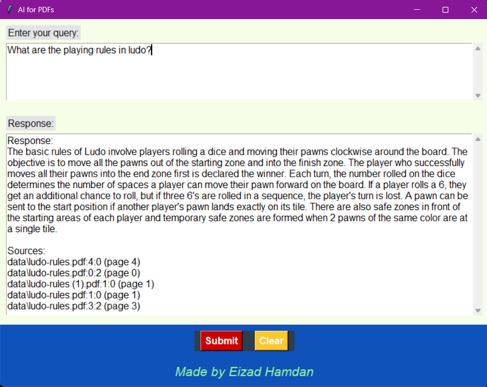

# AI for PDFs

This Python-based application delivers an intelligent assistant to answer user queries about PDFs. Built on Retrieval-Augmented Generation (RAG) principles, the assistant ensures high-quality, context-aware responses by integrating LangChain for natural language understanding, Chroma for vector database operations, and Tkinter for a user-friendly interface.

## Features

### 1. RAG-Based Query Handling:
- Combines retrieval from the PDF database with generation of natural language answers.
- Ensures responses are accurate and grounded in source materials.
### 2. User-Friendly Interface:
- A clean and intuitive Tkinter GUI for easy interaction.
- Provides query input, response display, and context metadata.
### 3. Customizable Components:
- Flexible embedding models and database management.
- Easy integration of additional features.

## Project Structure

The repository includes the following Python files. A description of each file can be found in [FILE_DESCRIPTIONS.md](FILE_DESCRIPTIONS.md):

1. `create_databse.py`
2. `embedding_function.py` 
3. `query_data.py`
4. `test_rag.py`
5. `main.py`


## Setup Instructions

1. Clone the repository:
   ```bash
   git clone https://github.com/eizadhamdan/AI-Chatbot-for-Docs.git
   cd AI-Chatbot-for-Docs/AI_for_PDFs
   ```
2. Install dependencies:
   ```bash
   pip install -r requirements.txt
   ```
3. Add your OpenAI API key to a `.env` file:
   ```bash
   OPENAI_API_KEY=your_api_key_here
   ```
4. Run the create database script:
   ```bash
   python create_database.py
   ```
5. Run the main script:
   ```bash
   python main.py
   ```
   
## Screenshots
Below are screenshots demonstrating the app in action:


