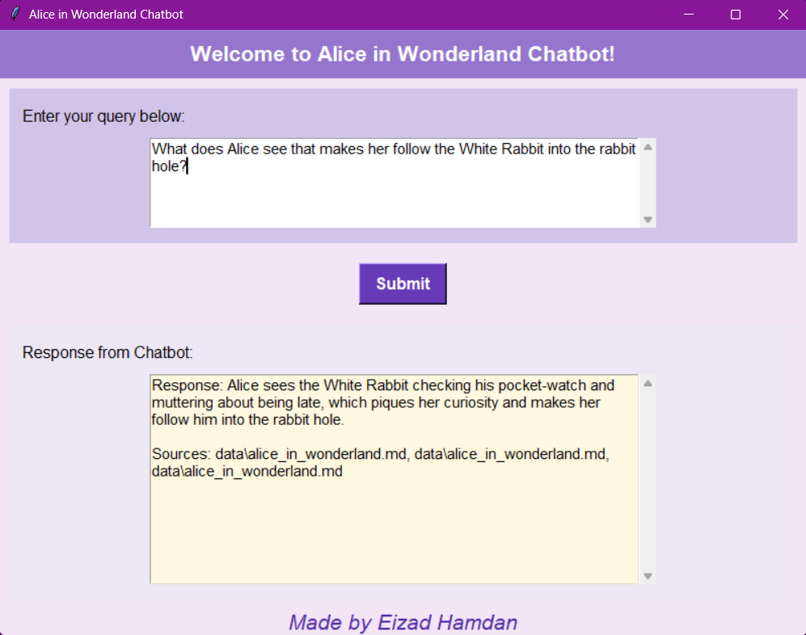
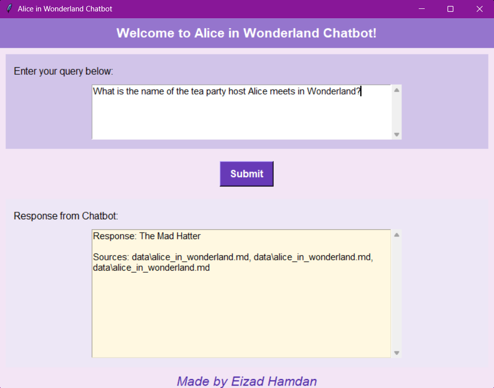

# AI Chatbot for Docs

# Alice in Wonderland Chatbot: A Retrieval-Augmented Generation (RAG) Approach

This project implements a chatbot capable of answering questions specifically about Lewis Carroll's *Alice in Wonderland*. The chatbot is built using the **Retrieval-Augmented Generation (RAG)** technique, leveraging `langchain`, `openai`, and `Chroma` for intelligent and context-aware responses.

## Key Features

- **Custom Knowledge Base**: The chatbot is powered by a database built from *Alice in Wonderland* data, enabling precise and story-specific answers.
- **Chroma Vector Store**: Efficient embedding storage and retrieval using the `Chroma` database.
- **LangChain Integration**: Simplified workflows for text processing and embedding.
- **OpenAI API**: High-quality language model responses tailored to user queries.

## File Descriptions

### 1. `create_database.py`
This script handles the creation of a vector database from the *Alice in Wonderland* data.

**Core Functions**:
- **`load_documents`**: Loads text data from a specified directory (`data`) containing `.md` file.
- **`split_text`**: Splits the documents into manageable chunks for embedding, ensuring overlap for better context.
- **`save_to_chroma`**: Saves the text chunks as embeddings in a Chroma vector store.

### 2. `compare_embeddings.py`

This script allows users to analyze and compare the embeddings generated by the OpenAI model, providing insights into the semantic relationships between words or phrases.

**Core Functions**:
- **`OpenAIEmbeddings`**: Generates embeddings for input queries.
- **`load_evaluator`**: Loads a pairwise embedding distance evaluator to compare the similarity between two embeddings.
- **Embedding Analysis**: Prints the vector and its length for a given query, and calculates the semantic similarity between two words or phrases.

**Example Usage**:
- Generate and inspect the embedding vector for a single word (e.g., "apple").
- Compare the embeddings of two words (e.g., "apple" vs. "iphone") to determine their semantic similarity.

Run the script with:
```bash
   python compare_embeddings.py
```

### 3. `main.py`

This script provides a user-friendly **Graphical User Interface (GUI)** to interact with the chatbot. Users can input their queries about *Alice in Wonderland* and receive context-based responses along with source information.

**Core Features**:
- **Tkinter GUI**: A visually appealing and easy-to-use interface.
- **Query Processing**: Fetches contextually relevant text chunks from the Chroma database using semantic similarity.
- **Response Generation**: Leverages OpenAI's GPT model to generate answers based on retrieved context.
- **Source Attribution**: Includes the sources of the context used to formulate the response.

**Components**:
- **Input Area**: A scrolled text box for entering queries.
- **Response Area**: Displays the chatbot's response and sources in a separate scrolled text box.
- **Submit Button**: Sends the query for processing.
- **Visual Design**: The GUI uses a purple-themed color scheme for a playful and engaging user experience.

#### Screenshots




**Example Workflow**:
1. User enters a question about *Alice in Wonderland*.
2. The chatbot retrieves relevant chunks from the Chroma vector store.
3. OpenAI's model generates a response based on the retrieved context.
4. The response and sources are displayed in the output area.

## How It Works

1. **Data Preprocessing**:
   - Text from *Alice in Wonderland* is loaded from `.md` file in the `data` directory using `DirectoryLoader`.
   - The text is divided into smaller, manageable chunks with overlap using `RecursiveCharacterTextSplitter`. This ensures context continuity and optimizes embedding quality.
   - The processed chunks are stored in a persistent Chroma vector store, where each chunk is embedded using `OpenAIEmbeddings`.

2. **Embedding Analysis**:
   - The embeddings are analyzed and compared using the `compare_embeddings.py` script.
   - Semantic similarity between words or phrases is calculated using a pairwise embedding distance evaluator, providing insights into the relationships between different embeddings.

3. **Question Answering**:
   - The chatbot retrieves the most relevant chunks from the Chroma vector store based on the semantic similarity to the user query.
   - It uses OpenAI's GPT model to generate responses, guided by a custom prompt template that incorporates the retrieved context.
   - The chatbot ensures transparency by displaying the sources of the retrieved context alongside its response.

4. **Graphical User Interface (GUI)**:
   - A Tkinter-based GUI in `main.py` provides an intuitive platform for user interaction.
   - Users can enter their queries, view the chatbot's response, and explore the sources in a visually engaging interface.
   - The GUI emphasizes ease of use, designed with a playful purple theme inspired by the whimsical nature of *Alice in Wonderland*.

## Setup Instructions

1. Clone the repository:
   ```bash
   git clone https://github.com/eizadhamdan/AI-Chatbot-for-Docs.git
   cd AI-Chatbot-for-Docs
   ```
2. Install dependencies:
   ```bash
   pip install -r requirements.txt
   ```
3. Add your OpenAI API key to a `.env` file:
   ```bash
   OPENAI_API_KEY=your_api_key_here
   ```
4. Run the create database script:
   ```bash
   python create_database.py
   ```
5. Run the main script with:
   ```bash
   python main.py
   ```
